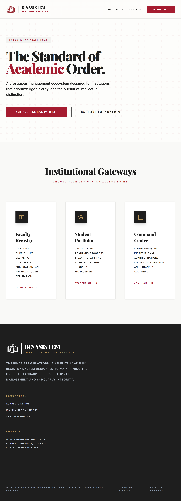

<div align="center">

# 🏛️ BINASISTEM
**Sistem Manajemen E-Learning, Administrasi Akademik & Layanan Keuangan Sekolah Terpadu**

[](https://laravel.com)
[](https://www.php.net)
[](https://www.mysql.com)
[](/)
[](#)

*Portal Pendidikan Prestisius: Mengintegrasikan Pembelajaran Digital (LMS), Manajemen Civitas Akademika, Evaluasi Hasil Belajar (CBT), serta Transparansi Layanan Keuangan Siswa dalam Satu Ekosistem yang Disiplin dan Profesional.*

</div>

---

## 📖 Tentang Proyek

**BinaSistem** adalah platform manajemen sekolah elit yang dirancang untuk mengusung standar tata kelola akademik tertinggi. Terinspirasi dari estetika institusi pendidikan dunia, sistem ini menyediakan infrastruktur digital yang kokoh untuk mendukung tiga pilar utama sekolah modern:
1. **Pusat Pembelajaran Digital (E-Learning Hub)**: Fasilitas distribusi materi (manuscript), penugasan terstruktur, dan ujian berbasis komputer (CBT) yang aman dan akuntabel.
2. **Manajemen Civitas Terpadu**: Kendali menyeluruh atas data siswa, guru, serta struktur kelas dan kurikulum yang fleksibel namun tetap disiplin.
3. **Integritas Layanan Keuangan**: Sistem penagihan iuran pendidikan (SPP) otomatis yang terhubung dengan dasbor pemantauan riil untuk meminimalisir kendala administrasi keuangan.

Dengan antarmuka **"Clear Harvard"**, BinaSistem menjamin pengalaman pengguna yang bebas gangguan (*distraction-free*), memprioritaskan tipografi yang elegan, dan navigasi yang sangat stabil di berbagai perangkat.

---

## 🎨 Identitas Visual & Filosofi Logo

<div align="center">
  
</div>

<br>

Logo resmi **BinaSistem** dirancang untuk mencerminkan warisan nilai akademik yang kekal, keterbukaan ilmu pengetahuan, dan ketegasan sistem digital. Berikut adalah penjabaran makna mendalam di balik identitas visual ini:

### 1. Simbolisme Gerbang & Buku (*Arch & Open Book*)
Identitas visual ini menggabungkan dua elemen fundamental pendidikan:
- **Buku Terbuka**: Melambangkan sumber pengetahuan yang tidak terbatas, keterbukaan pikiran, dan transparansi dalam proses belajar-mengajar.
- **Gerbang Lengkung (*Academic Arch*)**: Arsitektur gerbang melambangkan pintu masuk menuju masa depan yang lebih cerah dan transisi dari ketidaktahuan menuju pencerahan intelektual.

### 2. Pelita Pengetahuan (*The Lamp of Knowledge*)
Di bagian puncak logo terdapat simbol pelita yang menyala:
- **Cahaya Ilmu**: Melambangkan bimbingan guru dan visi sekolah dalam menerangi jalan para siswa.
- **Api Inovasi**: Menunjukkan bahwa meskipun berbasis tradisi, BinaSistem tetap mengusung api teknologi dan inovasi digital yang dinamis.

### 3. Filosofi Warna: Harvard Crimson
Penggunaan warna utama **Crimson (#A51C30)** bukan sekadar pilihan estetika, melainkan pernyataan karakter:
- **Kekuatan & Martabat**: Crimson mewakili gairah untuk belajar dan keberanian dalam mempertahankan integritas akademik.
- **Tradisi Elit**: Memberikan kesan institusi yang mapan, prestisius, dan memiliki standar kualitas kelas dunia.
- **Kejelasan Visual**: Dipadukan dengan warna **Ink (#1E1E1E)** dan **Ivory (#FDFDFB)** untuk menciptakan hierarki visual yang tajam dan profesional.

---

## ✨ Fitur & Modul Utama

### 👑 1. Command Center (Administrator)
- **Manajemen Civitas**: Kendali mutlak pendaftaran guru, siswa, dan staf dengan sistem status aktif/non-aktif.
- **Arsitektur Akademik**: Pengelolaan ruang kelas (Academic Spaces), jurusan (Majors), dan mata pelajaran (Curriculum).
- **Audit Keuangan**: Pemantauan status pembayaran SPP siswa, generator invoice otomatis, dan ekspor data keuangan terpadu.

### 👨‍🏫 2. Faculty Desk (Guru)
- **Manuscripts Storage**: Distribusi materi pembelajaran dalam berbagai format yang dapat diakses siswa kapan saja.
- **Evaluasi & Penugasan**: Manajemen tugas harian (Assignments) lengkap dengan fitur penilaian massal dan umpan balik guru.
- **Examination System (CBT)**: Penyelenggaraan ujian digital dengan bank soal terintegrasi dan sistem penilaian otomatis.
- **Presensi Digital**: Rekam kehadiran siswa yang tervalidasi oleh sistem.

### 🎒 3. Student Portfolio (Murid)
- **Academic Progress**: Dasbor pribadi untuk memantau nilai, status tugas, dan capaian pembelajaran.
- **E-Literature Access**: Perpustakaan digital pribadi untuk mengunduh materi dari fakultas.
- **Bursary Portal**: Informasi tagihan iuran sekolah (Invoice) yang transparan dan riwayat pembayaran yang terdokumentasi.

### 📱 4. Keunggulan UX & Stabilitas Antarmuka
- **Persistent Sidebar**: Sistem navigasi cerdas yang mengingat preferensi pengguna (terbuka/tertutup) di seluruh halaman melalui *LocalStorage*.
- **Icon-Only Mode**: Sidebar yang dapat dikecilkan menjadi ikon saja untuk memberikan ruang kerja maksimal tanpa kehilangan akses navigasi.
- **Harvard Aesthetic**: Desain bersih tanpa gangguan warna yang berlebihan (*No-Alay Design*), memprioritaskan keterbacaan teks dan kemudahan interaksi.

---

## 🔐 Informasi Kredensial Demo

Gunakan akun demo berikut untuk menjelajahi fungsionalitas sistem di lingkungan lokal:

| Peran Dasbor | Email Akses | Kata Sandi | Kapabilitas Utama |
| :--- | :---: | :---: | :--- |
| **Super Administrator** | `admin@sekolah.com` | `password123` | Manajemen penuh sistem, civitas, dan keuangan |
| **Guru (Faculty)** | `guru1@sekolah.com` | `password123` | Pengelolaan materi, tugas, ujian, dan nilai |
| **Murid (Student)** | `murid1@sekolah.com` | `password123` | Akses materi, mengerjakan tugas, dan cek tagihan |

---

## 🚀 Panduan Instalasi Lokal

### 1. Kloning & Persiapan
```bash
git clone https://github.com/hiu-kencana-widhi/BinaSistem.git
cd school-management
composer install
npm install
```

### 2. Konfigurasi Lingkungan
```bash
cp .env.example .env
php artisan key:generate
```
*Atur koneksi DB di berkas `.env` Anda.*

### 3. Database & Assets
```bash
php artisan migrate --seed
npm run build
```

### 4. Jalankan Portal
```bash
php artisan serve
```
*Akses: `http://localhost:8000`*

---

## 🔄 Alur Kerja Sistem (System Workflows)

### A. Alur E-Learning & Evaluasi
```
[ Guru: Unggah Materi/Tugas ] ──► [ Notifikasi di Dasbor Siswa ]
                                            │
                                  [ Siswa: Mengerjakan & Submit ]
                                            │
                                  [ Guru: Memberi Nilai & Catatan ]
                                            │
                                  [ Siswa: Lihat Hasil di Portfolio ]
```

### B. Alur Manajemen Keuangan (SPP)
```
[ Admin: Generate Invoices Bulanan ] ──► [ Tagihan Muncul di Dasbor Siswa ]
                                                 │
                                     [ Siswa: Melakukan Pembayaran ]
                                                 │
                                     [ Admin: Validasi & Update Status ]
```

---

<br>

<div align="center">

## 📸 GALERI ANTARMUKA & CUPLIKAN LAYAR
Dokumentasi visual antarmuka BinaSistem yang profesional dan responsif.

</div>

<br>

### 🖥️ Dasbor Utama (Command Center)
*Tampilan antarmuka manajemen terpusat dengan estetika Harvard yang bersih.*



---

<div align="center">
<br>

**Didedikasikan untuk meningkatkan martabat pendidikan melalui tata kelola digital yang disiplin dan transparan.**  
© Hak Cipta Portal Akademik Terpadu **BinaSistem**.

</div>


